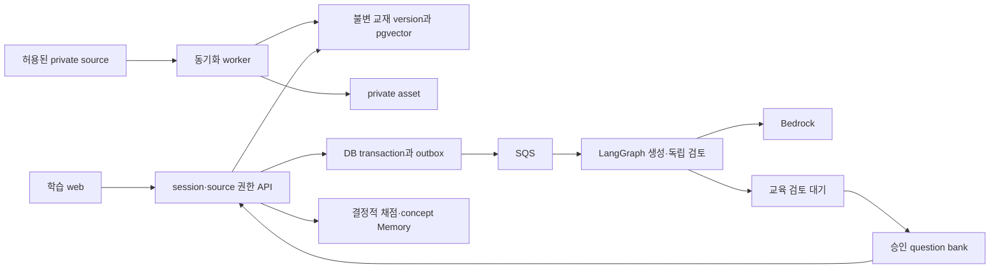

# 서비스 구조와 기술 결정

> 공개용 정제본이다. 서비스 구현과 실제 provider 지원을 주장하지 않는다.

## 구성

UI는 React + TypeScript + Vite, API/worker는 Python FastAPI project를 공유하되 별도 process로 실행한다. PostgreSQL + pgvector, SQLAlchemy/Alembic, Python/frontend lockfile을 사용한다. local containers는 web/API/worker/Postgres를 제공한다. local queue는 DB adapter로 SQS를 대체하고 source/model/auth는 명시적 fake adapter로 대체한다. fake auth에는 다른 learner 2명과 admin을 제공하되 staging/production은 fake 설정으로 시작하면 실패한다.

AWS target은 Terraform으로 VPC, ECS Fargate API/worker, ALB, RDS PostgreSQL, SQS/DLQ, private S3, Cognito, Secrets Manager, CloudWatch, ECR을 관리한다. CloudFront static origin은 OAC private S3이고 `/api/*`, `/auth/*`는 ALB origin으로 전달한다. API/auth는 cache하지 않고 필요한 Cookie/header/query/method를 전달한다. SPA fallback은 static path에만 적용한다.

Bedrock은 runtime 생성·독립 검토·embedding provider다. 구현 role model과 별개다. LangChain adapter, 제한된 LangGraph state flow, pgvector retrieval을 사용하며 별도 knowledge-base product를 중복 구축하지 않는다. account/region별 model/API/structured-output/embedding 지원은 실제 배포에서 확인한다.

## 인증과 교재 권한

same-origin BFF를 사용한다. `/auth/login`이 Cognito authorization code + PKCE를 시작하고 server가 짧은 수명의 state/nonce/verifier를 보관한다. callback에서 state/OIDC 검증 뒤 server session을 만든다. token/refresh token은 암호화 저장하고 browser에는 `__Host-session; Secure; HttpOnly; SameSite=Lax; Path=/`만 준다. 모든 mutation은 session-bound CSRF와 Origin을 검사한다.

JWT는 signature/algorithm/JWKS/issuer/expiry/token type을 검사한다. access token은 `token_use=access`, `client_id`, scope와 필요 시 API audience를 확인한다. ID token은 OIDC login용이며 API 권한 token으로 받지 않는다.

verified subject는 server user와 연결하고 admin role은 DB에서 확인한다. invitation만으로 모든 source를 읽을 수 없다. `course_memberships`가 사용자별 course 권한을 기록한다. API, worker, retrieval 모두 user/course/version 조건을 강제하며 prompt가 filter를 바꿀 수 없다.

## Source → 불변 교재 version

허용 root 아래 승인 page 집합만 수집한다. 일반 link를 따라 확장하지 않는다. pagination/nested block/rate-limit/backoff와 stable locator, heading path, raw text, edit metadata, content hash를 저장한다. 수집 전후 변경을 확인해 변경 중이면 bounded re-fetch한다. 전체 text mapping과 필수 evidence를 확인한 뒤 active pointer를 transaction으로 교체한다.

이전 version은 참조되는 동안 immutable이다. version hash는 course에 종속하고 다른 course의 권한과 공유하지 않는다. 보강 설명은 별도 검토된 새 source version의 학습 section이 된 뒤에만 출제 evidence가 된다. retrieval은 course/unit/concept/version을 먼저 제한한다. source는 untrusted data이며 tool/shell/model-system 지시로 실행하지 않는다.

만료 URL은 영구 주소가 아니다. 허용 asset만 private storage에 복사하고 size/MIME/decode/checksum, HTTPS host, DNS/IP와 redirect를 검사해 SSRF를 막는다. SVG/HTML은 app origin에서 그대로 실행하지 않고 검증된 raster derivative를 사용한다. Markdown/link도 allowlist sanitize한다. `/api/v1/assets/{id}`가 session/source/version 권한 뒤 bytes를 proxy하고 `private,no-store,nosniff`를 설정한다.

확인된 403/404/삭제/철회는 즉시 `revoked`로 바꾸고 content/generation/in-progress assessment를 막는다. transient network/429/5xx는 마지막 접근 가능한 version을 최대 24시간 유지하고 그 뒤 `stale`로 fail closed한다. cache 삭제 전에도 DB 차단 상태를 먼저 검사한다.

## 생성·게시·queue

정상 상태는 `requested → retrieved → drafted → schema_checked → independently_reviewed → review_pending → ready`다. quality failure는 `quarantined`, retry 소진은 `failed`, source 철회는 `cancelled`다. `ready`는 question 수, blueprint, 사람 승인을 모두 충족한다.

server가 blueprint와 allowed source ID를 고정한다. 후보는 보기 4개, 정답 1개, 보기별 explanation, source ID, length/duplicate/scope/condition을 검사한다. 독립 reviewer는 generation 대화와 answer key 없이 푼다. 수정은 새 question version과 review가 필요하다.

기본 generation 1회 + correction 최대 2회, 전체 call/time/token/day/user/cost limit을 적용한다. 마지막 section completion transaction이 user/unit/source-version 요청을 한 번 만들고 generation job/outbox를 함께 기록한다. SQS는 job ID만 싣는다. worker는 DB lease/fencing과 visibility 연장을 사용하고 DB commit 뒤 message를 삭제한다. 외부 model exactly-once는 주장하지 않으며 duplicate cost를 budget으로 제한한다. DLQ는 infra failure용이고 교육 보류는 정상 `review_pending`이다.

## 채점과 Memory

고정 question version answer와 opaque option ID를 비교하는 server code로 채점한다. LLM은 score/pass/user isolation을 결정하지 않는다. 하나의 transaction에서 submit, item score, concept observation, `concept_memory`를 갱신하고 unique constraint로 중복 관찰을 막는다.

정오답·misconception·시각·question version의 관찰과 추정 mastery를 분리한다. 초기 review는 실패 뒤 1일, 서로 다른 문항 성공 뒤 3일/7일 heuristic이다. 같은 문제 재풀이는 새 mastery evidence가 아니다. challenge 확인 뒤 철회 문항 observation을 void하고 유효 관찰로 Memory를 결정적으로 재계산한다.
